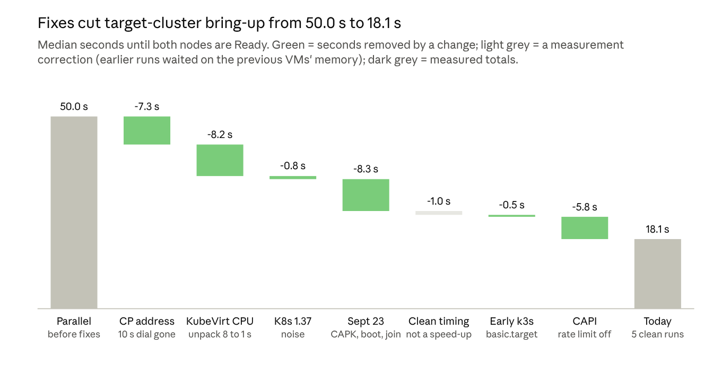

# Why the target cluster is ready in 18 seconds

2026-09-30 · Mahipal

The sovereign_cloud target cluster (one k3s control plane and one worker on KubeVirt VMs) reaches both nodes Ready in a median of **18.1 seconds**, measured over 5 clean rebuilds on 2026-09-30 (every run 17.7–18.3 s). A typical cloud Kubernetes cluster takes 10 minutes or more.

The difference is where the work happens. A normal cluster does everything at creation time: it rents machines, installs software, downloads images, generates certificates and joins nodes one after another. This platform does as much as it can once, ahead of time. The repo's own measurements show that most of the remaining gain came from removing specific waits, not from doing less work.

## Where a normal cluster's 10+ minutes go

Almost all of the time is spent waiting on a cloud API, a download or an earlier step. The ranges below are typical and approximate for a managed service (EKS, AKS, GKE) or kubeadm on cloud VMs; they were not measured here.

1. **Getting machines, 1–3 min.** The cloud API allocates VMs, attaches disks and networks, and boots a full OS.
2. **Installing software, 2–5 min.** Packages, a container runtime and kubeadm/kubelet are installed, and control-plane and network-plugin images are pulled from the internet.
3. **Bootstrapping the control plane, 1–3 min.** It creates a certificate authority and certificates, starts etcd from empty, starts the API server and applies system add-ons.
4. **Joining workers one after another, 2–5 min.** Workers usually start only after the control plane is up, then pull their own images and wait for the network plugin.
5. **Managed-service extras.** Load balancers, IAM and health gates add minutes on top.

## What the target cluster does instead

Each slow step of a normal build is either done once ahead of time or run in parallel.

| Step | Normal cluster | Target cluster |
| --- | --- | --- |
| Machines | Rents cloud VMs through an API | KubeVirt VMs start as pods on the already-running cluster2, with no outside API |
| Cluster creation controllers | A provisioning pipeline creates each resource in turn | Cluster API with its per-object rate limit turned off, so both VM objects exist about 1 s after apply |
| Software | Installs the OS and Kubernetes at boot, downloading images | Boots a pre-baked golden image (`:warm`) with k3s and all images inside, served from a local registry, so nothing is downloaded |
| Kubernetes distribution | kubeadm with separate components | k3s, a single binary with a much smaller control plane |
| Certificates and etcd | Creates a CA and certificates, then initialises etcd | Fixed CAs and join token are baked into the image and pre-seeded into Cluster API's secrets, so first boot skips certificate creation and the etcd reset (`--cluster-reset`) |
| Starting the control plane | Starts once provisioning scripts finish | k3s starts as soon as cloud-init has written its files, before cloud-init's final stage |
| Joining the worker | Worker starts after the control plane is ready | Worker VM boots at the same time as the control plane; only the k3s join waits for it |

## What actually moved the number

The golden image was not the main win: on its own it measured 48.5 s, no faster than plain parallel boot (46.6–50.0 s). Removing specific stalls took bring-up from 50.0 s to 18.1 s.

*Median seconds until both nodes are Ready. Sources: CLAUDE.md, docs/sub-60s-cluster-strategy.md and time-to-ready-by-name.sh runs, 2026-09-09 to 2026-09-30.*

The "Sept 23 fixes" step is four commits measured together: the CAPK controller patch (a 2–30 s stall creating the control-plane VM), guest boot trims (about 4 s per VM), worker join gated on control-plane readiness, and VM-to-VM routing through the gateway. On 2026-09-30, turning off Cluster API's per-object rate limit (one reconcile per object per second, on by default) cut the controller chain from about 7 s to 1 s, and starting k3s as soon as cloud-init has written its files saved another 0.5 s. The control plane is now Ready at 14.3 s and the worker 3.8 s later. The "Clean timing" step is not a speed-up: earlier runs started before the previous VMs had released their memory, which added about 1 s.

## Caveats for a fair comparison

The 18.1 s covers only creating the cluster; the setup behind it is paid for once, up front.

- **Prepared in advance.** Baking the golden image takes about 205 s, and cluster2, KubeVirt, Cluster API and the local registry must already be running.
- **Small and local.** One control plane and one worker on k3s, all on one host, with no cloud load balancers or IAM. A 50-node production cluster with managed extras would not get these numbers, and it would want Cluster API's rate limit back on to protect its API server.
- **Shared identity.** Every target cluster uses the same baked certificate authority and join token. That is fine for a lab, but `TODO.md` lists the committed demo CA keys as a Sev1 item; production would need a unique identity per cluster.
- **Outside Istio's support range.** Kubernetes 1.37 is newer than Istio 1.31 officially supports (1.32–1.36). It passes every check here, but it's unsupported.
